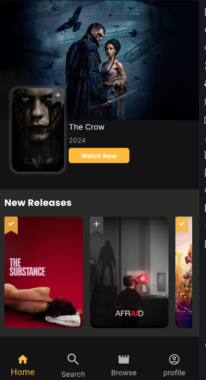
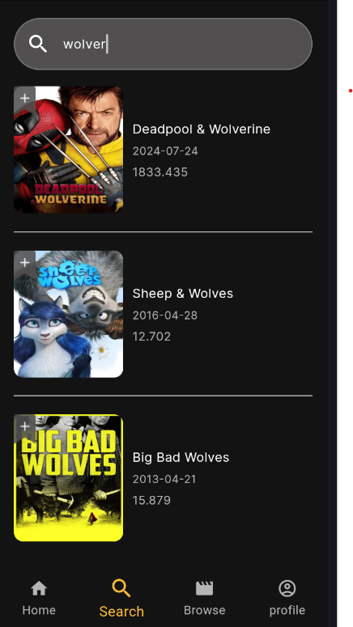
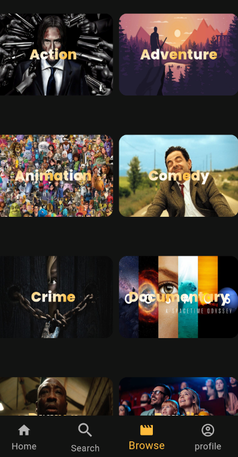

# Movie Night

Welcome to the **Movie Night** project! This is a Flutter application that allows users to explore and discover movies. Users can view movie details, browse different genres, and enjoy a seamless user experience.

## Features

- **Browse Movies:** Explore a wide range of movies with detailed information.
- **Search Functionality:** Quickly find movies using the search feature.
- **User-Friendly Interface:** A clean and intuitive design that enhances the user experience.

## Screenshots

### Home Screen


### Movie Details Screen


### Search Screen


### Genre Screen


## Technologies Used

- **Flutter:** UI toolkit for building natively compiled applications.
- **Dart:** Programming language used for Flutter development.
- **API Integration:** Using Http.
- **State Management:** Implementing state management Using Cubit.

## Installation

To get started with the Movie Night app, follow these steps:

1. **Clone the Repository**
   ```bash
   git clone https://github.com/Hossam-Abdou/movie-night.git
